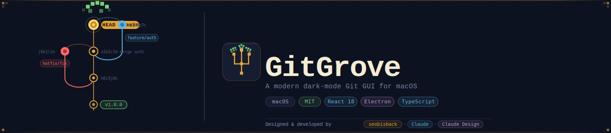
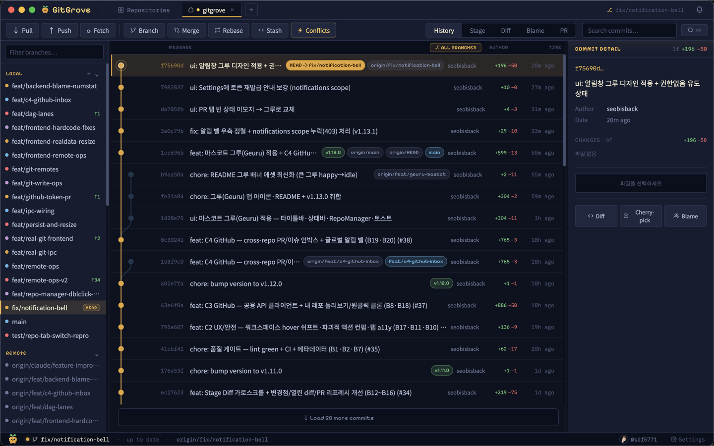
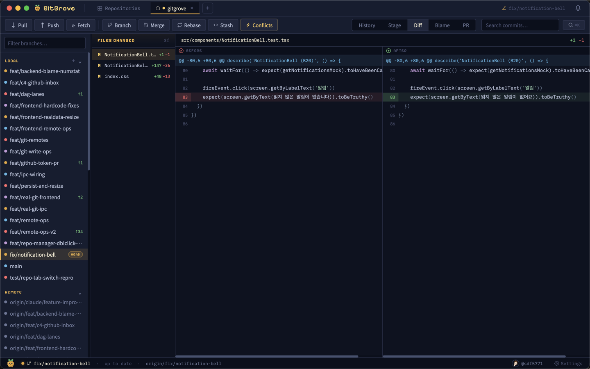
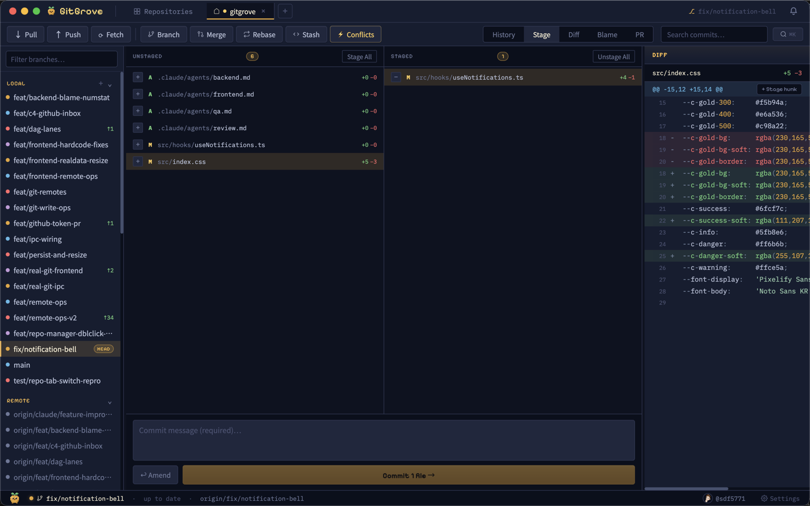
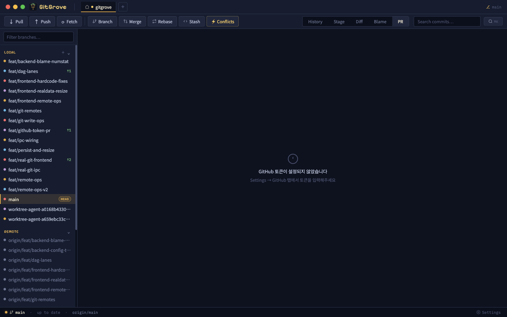

<div align="center">
  
</div>

<br>

<div align="center">

  [](LICENSE)
  [](https://github.com/seobisback/gitgrove/releases)
  [](https://react.dev)
  [](https://electronjs.org)
  [](https://typescriptlang.org)
  [](https://github.com/seobisback/gitgrove/pulls)

</div>

<br>

<div align="center">
  <strong>A professional dark-mode Git GUI desktop app for macOS.</strong><br>
  Visual branch graph · Staging area · Diff explorer · PR review — all in one window.
</div>

<br>

---

## ✦ Screenshots

<table>
  <tr>
    <td align="center" width="50%">
      
      <sub><b>History View</b> — Branch graph with bezier lanes + Commit detail panel</sub>
    </td>
    <td align="center" width="50%">
      
      <sub><b>Diff Explorer</b> — Side-by-side diff with syntax highlighting</sub>
    </td>
  </tr>
  <tr>
    <td align="center" width="50%">
      
      <sub><b>Stage View</b> — Unstaged ↔ Staged file mover + commit editor</sub>
    </td>
    <td align="center" width="50%">
      
      <sub><b>PR View</b> — GitHub PR list, file changes, CI checks</sub>
    </td>
  </tr>
</table>

---

## ✦ Features

### Core Views
| View | Description |
|------|-------------|
| **History** | SVG branch graph with bezier lane lines, merge nodes, label chips (HEAD / branch / tag / remote) |
| **Stage** | Two-column unstaged ↔ staged file mover, commit message editor, amend support |
| **Diff Explorer** | Full-screen side-by-side diff with syntax highlighting and file list |
| **Git Blame** | Line-by-line blame with author info — click to jump to commit |
| **PR Review** | Open / Merged PR list, file changes, inline comments, CI checks, approve / request-changes |

### Git Operations
| Operation | Details |
|-----------|---------|
| **Branch** | Create · Rename · Delete with force-delete option and confirm dialogs |
| **Merge / Rebase** | Merge commit · Rebase · Squash — with animated progress |
| **Interactive Rebase** | Drag to reorder, click to cycle pick / squash / fixup / edit / drop |
| **Cherry-pick** | Apply any commit to current branch, `--no-commit` option, conflict detection |
| **Stash** | Push with message, Pop / Apply / Drop, stash stack management |
| **Conflict Editor** | Side-by-side ours/theirs resolver with per-conflict choices and progress tracking |
| **Tag** | Create lightweight and annotated tags from any commit |
| **Config** | Read / write git config (user.name, user.email, etc.) |

### UX
- **⌘K Command Palette** — search and run any action from the keyboard
- **Live Commit Search** — real-time filter by message, author, hash, or file path
- **Multi-repo Tabs** — open multiple repos in one window, with dirty-state indicator
- **Right-click Context Menu** — Cherry-pick · Revert · Reset (soft / mixed / hard) · Branch here · Tag here
- **Branch Context Menu** — right-click any branch to Checkout / Merge / Rebase / Rename / Delete / Push / Pull
- **Confirm Dialogs** — every destructive operation (delete, reset --hard, drop, etc.) requires confirmation
- **Settings Panel** — Git config · Appearance · GitHub token for PR integration
- **Focus Auto-refresh** — repository state refreshes when the app regains focus

---

## ✦ Design System

GitGrove is built on the **모여봐요 design system** — warm-navy dark with gold/amber accents.

<table>
  <tr>
    <td></td>
    <td><code>#0d1220</code></td>
    <td>Background Deep</td>
    <td></td>
    <td><code>#e6a536</code></td>
    <td>Gold Accent</td>
  </tr>
  <tr>
    <td></td>
    <td><code>#161d30</code></td>
    <td>Surface</td>
    <td></td>
    <td><code>#6fcf7c</code></td>
    <td>Success / Grove</td>
  </tr>
  <tr>
    <td></td>
    <td><code>#1f273e</code></td>
    <td>Elevated</td>
    <td></td>
    <td><code>#5fb8e6</code></td>
    <td>Info / Branch</td>
  </tr>
</table>

**Typography:** `Pixelify Sans` (display) · `Noto Sans KR` (body) · `IBM Plex Mono` (code / hashes)

**Branch Lane Colors:**
```
lane 0 – main          ██  #e6a536  gold
lane 1 – feature/*     ██  #5fb8e6  blue
lane 2 – hotfix/*      ██  #ff6b6b  red
lane 3 – other         ██  #c39ad9  purple
```

---

## ✦ Tech Stack

```
Renderer      React 18 + TypeScript 5
Desktop Shell Electron 30
Git Backend   simple-git (wraps system git binary)
Styling       CSS custom properties (no framework)
Bundler       Vite 5 + vite-plugin-electron
Build         electron-builder
Fonts         Pixelify Sans · Noto Sans KR · IBM Plex Mono (Google Fonts)
```

---

## ✦ Getting Started

### Download (권장)

[Releases 페이지](https://github.com/sdf5771/gitgrove/releases/latest)에서 `GitGrove-Mac-*-Installer.dmg` 다운로드 후 Applications 폴더로 드래그.

> **⚠️ "앱이 손상되었습니다" 오류가 뜨는 경우**
>
> 앱이 현재 코드 서명 없이 배포되고 있어 macOS Gatekeeper가 차단합니다.  
> 실제로 손상된 것이 아니며, 아래 중 하나로 해결할 수 있습니다.
>
> **방법 1 — 터미널 (권장):**
> ```bash
> xattr -d com.apple.quarantine /Applications/GitGrove.app
> ```
> **방법 2 — Finder:**  
> GitGrove.app을 우클릭 → **열기** → **열기** 클릭

---

### Prerequisites (소스 빌드 시)

- macOS 13 (Ventura) or later
- Node.js 20+
- Git 2.38+

### Install

```bash
git clone https://github.com/sdf5771/gitgrove.git
cd gitgrove
npm install
```

### Development

```bash
npm run dev       # Vite dev server + Electron (via vite-plugin-electron)
```

### Production Build

```bash
npm run build     # renderer → dist/, electron → dist-electron/
```

Packaged `.app` is produced by electron-builder (see `package.json` for the build config).

---

## ✦ Project Structure

```
gitgrove/
├── electron/
│   ├── main.ts            Electron main process — BrowserWindow + 32 IPC handlers
│   ├── preload.ts         contextBridge → window.gitAPI
│   └── electron-env.d.ts  TypeScript types for IPC API
├── src/
│   ├── App.tsx            Root layout, state management, IPC wiring
│   ├── index.css          Design tokens + all component CSS
│   ├── components/
│   │   ├── CommitGraph.tsx    SVG branch graph with bezier lanes
│   │   ├── CommitDetail.tsx   Commit metadata, file list, diff preview
│   │   ├── DiffExplorer.tsx   Full-screen side-by-side diff
│   │   ├── DiffPanel.tsx      Inline diff panel (Stage / History)
│   │   ├── StageArea.tsx      Unstaged ↔ Staged file mover
│   │   ├── BlameView.tsx      Line-by-line git blame
│   │   ├── BranchSidebar.tsx  Local / Remote / Tags list
│   │   ├── BranchContextMenu.tsx  Right-click branch actions
│   │   ├── PRView.tsx         GitHub PR list + detail
│   │   ├── StatusBar.tsx      Bottom status line
│   │   └── modals/            BranchModal · MergeModal · CherryPickModal ·
│   │                          InteractiveRebaseModal · StashPanel ·
│   │                          SettingsPanel · ConfirmModal · …
│   ├── data/              Type definitions + mock data (fallback)
│   ├── hooks/             useNotifications
│   └── utils/             computeLanes · syntaxHighlight · sideBySide
├── assets/
│   ├── hero.svg           README hero banner
│   ├── color-*.svg        Design system color swatches
│   └── screenshot-*.png   App screenshots
└── README.md
```

---

## ✦ Keyboard Shortcuts

| Shortcut | Action |
|----------|--------|
| `⌘K` | Open command palette |
| `⌘1` | History view |
| `⌘2` | Stage view |
| `⌘3` | Diff Explorer |
| `⌘⇧B` | New branch |
| `⌘M` | Merge / Rebase |
| `⌘⇧S` | Stash |
| `⌘,` | Settings |
| `Esc` | Close topmost modal / clear search |

---

## ✦ Roadmap

- [x] Real Git backend (simple-git IPC, 32 handlers)
- [x] Branch graph with bezier lane lines
- [x] Stage / Commit / Amend
- [x] Side-by-side Diff Explorer with syntax highlighting
- [x] Interactive Rebase, Cherry-pick, Stash, Merge
- [x] GitHub PR integration (token-based)
- [x] Branch context menu, confirm dialogs for destructive ops
- [ ] SSH / HTTPS authentication manager
- [ ] Commit graph virtualization (large repos)
- [ ] Split-diff editor with inline editing
- [ ] Windows / Linux support
- [ ] Plugin system

---

## ✦ Design Reference

The full interactive design prototype and logo system are in [`assets/design/`](assets/design/):

- `assets/design/GitGrove.html` — interactive UI prototype (open in browser)
- `assets/design/GitGrove Logo.html` — logo system (app icon · wordmark · favicon)
- `assets/design/DESIGN_TOKENS.md` — all CSS tokens, typography, and branch colors

---

## ✦ Contributing

Pull requests are welcome. For major changes, please open an issue first.

---

## ✦ License

[MIT](LICENSE) — © 2026 GitGrove Contributors

---

<div align="center">
  <sub>Built with ♥ · Designed in <a href="https://claude.ai">Claude</a></sub>
</div>
